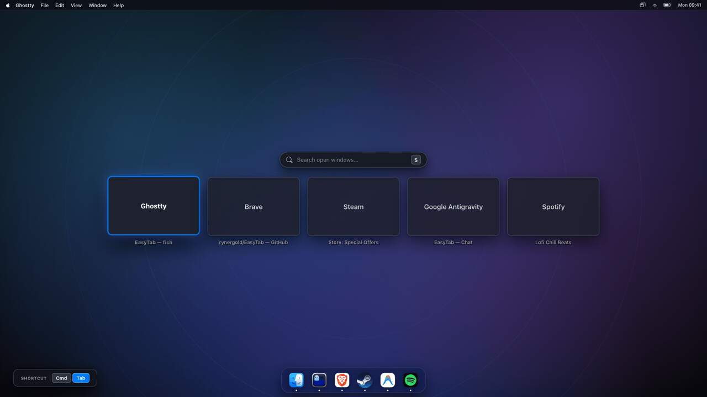

# EasyTab — Homebrew Tap & Public Distribution

Official public distribution repository and Homebrew tap for **EasyTab**, the fast, lightweight Command+Tab window switcher for macOS.

<br>

<div align="center">
  
</div>

---

## 📦 Installation

### Option 1: Homebrew (Recommended)

Install via Homebrew in a single command:

```bash
brew install --cask rynergold/easytab/easytab
```

Or tap the repository first:

```bash
brew tap rynergold/easytab
brew install --cask easytab
```

To update in the future:
```bash
brew upgrade --cask easytab
```

---

### Option 2: Direct Download (`.dmg`)

Download the latest signed `.dmg` installer directly from [Releases](https://github.com/rynergold/homebrew-easytab/releases).

1. Open **`EasyTab.dmg`**.
2. Drag **EasyTab.app** into your **Applications** folder.
3. Open **EasyTab.app** and grant **Accessibility permissions** when prompted.

---

## ✨ Features & Controls

| Shortcut | Action |
| :--- | :--- |
| `⌘ Cmd + Tab` | Open switcher / cycle forward to next window (MRU order) |
| `Release ⌘ Cmd` | Instantly focus & raise selected window |
| `S` | Instant window search (filter by app name or window title) |
| `Enter` / `Release ⌘` | Confirm selected search result |
| `Esc` | Cancel switcher without changing window |

---

## 📄 License & Terms

EasyTab is freeware (free for personal, educational, and commercial use). All rights reserved. The source code and branding are proprietary and closed-source.
